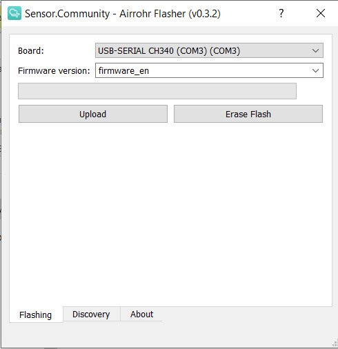
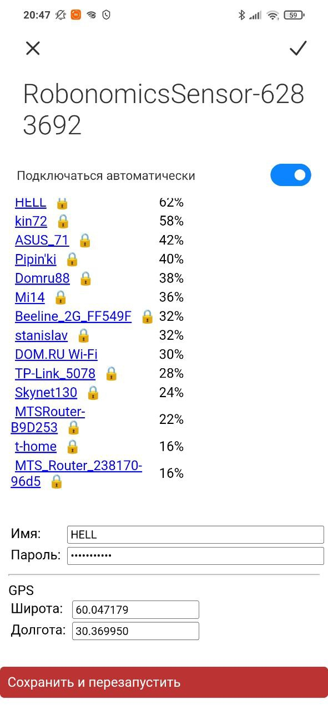
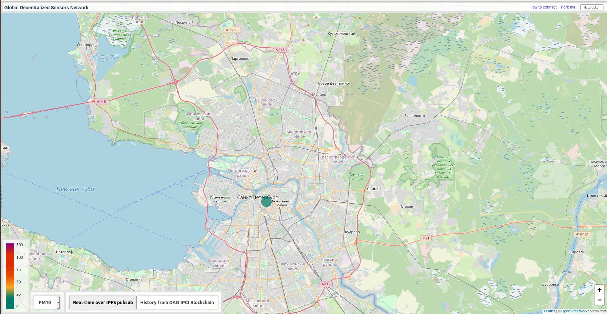
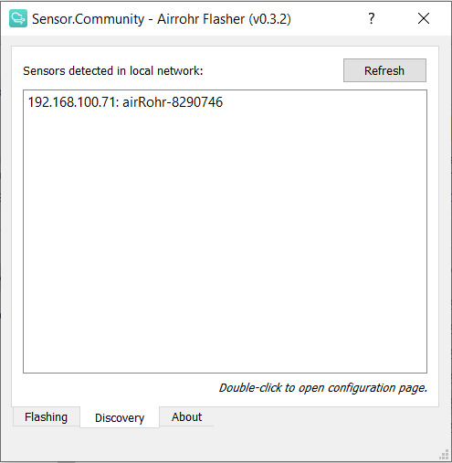
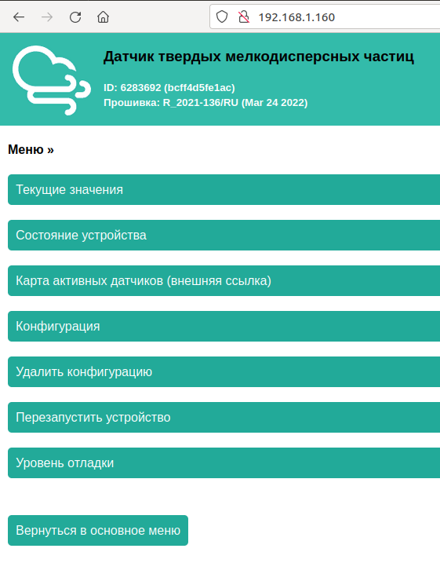
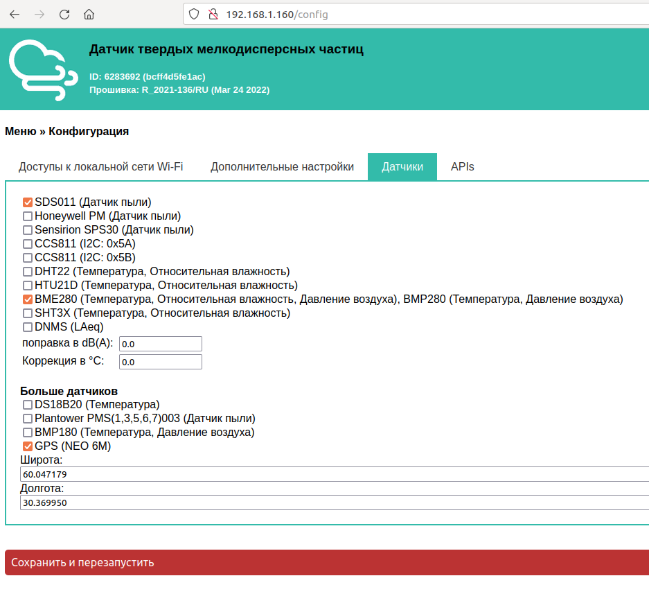
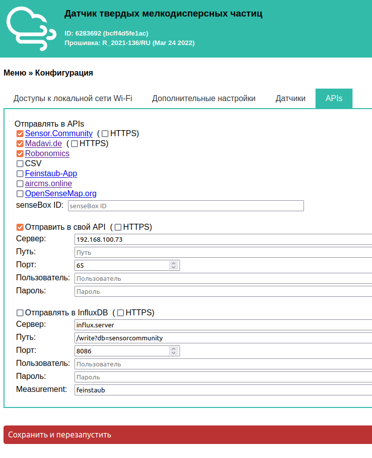

# Прошивка и настройка датчика

После получения/сборки датчика остается только прошить и настроить его.

## Прошивка

Наша прошивка основана на прошивке от [Sensor.Community](https://github.com/opendata-stuttgart/sensors-software), в которую были добавлены несколько датчиков и изменена схема отправки данных. Исходный код можно найти [по ссылке](https://github.com/LoSk-p/sensors-software/tree/master/airrohr-firmware). 

Чтобы прошить датчик вы можете использовать `airrohr-flasher`. Скачайте исполняемый файл для вашей операционной системы из [последнего релиза](https://github.com/airalab/sensors-connectivity/releases).

### Для Linux

Сначала вам нужно добавить пользователя в группу `dialout` (для Ubuntu) для получения доступа к USB порту:

```bash
sudo usermod -a -G dialout $USER
```

После этого перезагрузите компьютер. Далее поменяйте разрешения файла и запустите его:

```bash
chmod +x airrohr-flasher-linux
./airrohr-flasher-linux
```

### Для Windows:
Распакуйте флешер и запустите его двойным кликом. Также вам нужно установить драйвера для USB2serial (Windows 10 должен начать загрузку автоматически):

* Драйвера для NodeMCU v3 (CH340): [Windows](http://www.wch.cn/downloads/file/5.html) ([2018/09/04 v3.4 зеркало](https://d.inf.re/luftdaten/CH341SER.ZIP))

### Для MacOS
Скачайте флешер и запустите его. Также вам нужно установить драйвера для USB2serial: 
* Драйвера for NodeMCU v3 (CH340): [MacOS](http://www.wch.cn/downloads/file/178.html) ([2018/09/04 v1.4 зеркало](https://d.inf.re/luftdaten/CH341SER_MAC.ZIP))

---

Выберите прошивку (на английском или на русском) и нажмите `Upload`. Загрузка прошивки займет некоторое время.



## Настройка

После загрузки прошивки перезагрузите ESP (просто отключите и подключите заново USB).

Через некоторое время после перезагрузки ESP создаст Wi-Fi сеть с названием RobonomicsSensor-xxxxxxx. Подключитесь к ней с телефона или с компьютера, далее откроется окно авторизации (если оно не открылось в любом браузере перейдите по адресу 192.168.4.1). Выберете в списке вашу Wi-Fi сеть (или напишите сами, если ее нет в списке) и заполните поле с паролем. Также напишите координаты места, где будет установлен датчик, в поле ниже:



Нажмите `Сохранить и перезапустить`.

Плата подключится к указанной Wi-Fi сети и через пару минут вы сможете увидеть данные на [карте](https://sensors.robonomics.network/#/):



## Дополнительная настройка

Для более детальной настройки (она может понадобиться для подключения дополнительных датчиков или отправки данных на собственный сервер) вам нужно найти адрес датчика в вашей Wi-Fi сети. Для этого можно использовать `airrohr-flasher` (ваш компьютер должен находиться в той же сети, к которой подключен датчик). Запустите его и перейдите во вкладку `Discovery`, далее нажмите `Refresh`, подождите немного и появится адрес вашего датчика.



Перейдите по этому адресу двойным кликом (или введите его в браузере), вы попадете в меню датчика:



Во вкладке `Конфигурация` можно настроить используемые датчики:



А также настроить отправку на собственный сервер. Для этого во вкладке `APIs` нужно убрать отметку с `Robonomics` и отметить `Отправить в свой API` и указать адрес сервера и порт (65 для sensors connectivity):



Для сохранения настроек нажмите `Сохранить и перезапустить`.